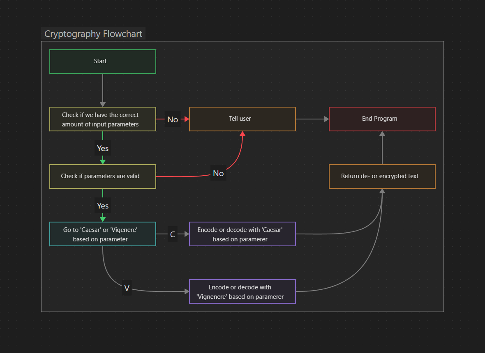

# Cryptography

You will implement two cryptosystems:
    [Caesar cipher](https://en.wikipedia.org/wiki/Caesar_cipher)
    [Vigenère cipher](https://en.wikipedia.org/wiki/Vigen%C3%A8re_cipher)
    

Draw a flowchart for this [problem](#problem).
> Flowchart : 

Make code to solve the [problem](#problem)
> Da code : [code](.src/main.c)

Changes made to the problem
> Da [Changes](#Changes)

Explain where i used modularization
> [here|•◡•|](#Modularization)
---

# Problem 

Implement the cryptosystem in section Cryptography. 

## Requirements:
- Flowchart
- Has a command-line interface
- Use modularization as much as possible, i.e., header files, functions for repetitive code.
- What was your [modularization](#Modularization) approach to each part you have implemented, i.e., CLI, Caesar, Vigenere? 1-3 sentences per part are enough. Include this test in your README.
- For your header files you use include folder.
- Your header file is documented using Doxygen syntax.


## Caesar
You have to implement two functions:
```
> char *caesar_encrypt(char *plaintext);
> char *caesar_decrypt(char *ciphertext);
```
These functions work in-place, in other words, you don’t have to create a new string for the encrypted/decrypted text.

## Vigenère
Similar to Caesar, however every character in the plaintext can be shifted by a variable amount. The amount to shift is determined by the key of alphabetic characters, where A corresponds to 0, B 1, etc. There is a wrap-around if necessary like in Caesar.

Implement the functions:
```
> char *vigenere_encrypt(char *plaintext, char *key);
> char *vigenere_decrypt(char *ciphertext, char *key);
```
## Asumptions
You can assume that plaintext:
    is uppercase
    contains no spaces, numbers or punctuation

## Modularization
I made the function ***talCirkulærRundingMinMax()***, so i could easily get a int that fit in the alphabet mulitple times. 
caesar is a function that can en/decrypt text based on an int
Vigenère is a function that can en/decrypt text based on a char

# Changes
1. Made 
    - *vigenere_encrypt* and *vigenere_decrypt* into a single function with a parameter to change modes instead
    - Same for the Caesar functions

